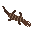

# In this repository are all the files used to create Salamander as well as a copy of the game and some extras

### Viewing the textures
If you'd like to view the raw .aseprite files, you'll need to purchase and install [Aseprite](https://www.aseprite.org/), although I also have .png and .gif versions of the textures 
in the textures directory. Keep in mind, these files were not used to make the game, as I have a separate project for parsing raw Aseprite files, which parses 
the files once when the code compiles.

### Other dependencies:
#### Loam, which is my C++ game library that makes rendering and stuff easier with SDL, and comes with a bunch of utility functions
#### My Aseprite parser, which I explained above

### To run the game, you'll need to be running Linux Mint and have SDL3 installed. So far, I've only gotten it to run on my own computer, and compiling it for other platforms was something I was never able to do because the game uses bleeding-edge C++26 features like reflection

